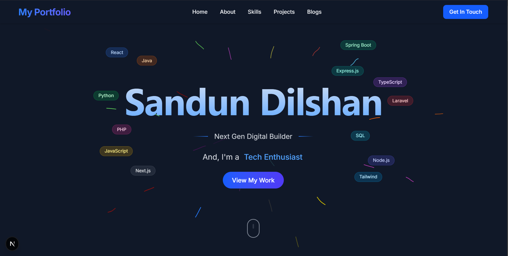

<h1 align="center" id="title"></h1>

A cutting-edge personal portfolio showcasing professional skills and projects, built with Next.js 15 and React 19. This dynamic web application features sophisticated animations powered by Framer Motion, including perspective transforms, 3D card effects, and subtle gradient overlays. The responsive interface uses Tailwind CSS v4 to deliver a polished experience across all devices. An interactive skills display organizes proficiencies across frontend, backend, and database technologies with animated progress indicators. The dark-themed design incorporates modern UI patterns with blue and purple accents, enhanced by a secure contact system integrated with Web3Forms API and hCaptcha protection. The architecture leverages Next.js App Router and Turbopack for optimal performance.

  
  
<h2>🧐 Features</h2>

Here're some of the project's best features:

*   Modern Tech Stack: Built with Next.js 15 and React 19
*   Responsive Design: Fully responsive layout using Tailwind CSS v4
*   Animations: Smooth animations powered by Framer Motion
*   Contact Form: Integrated with Web3Forms API and hCaptcha for secure form submissions
*   Performance Optimized: Uses Next.js App Router and Turbopack for faster development

  
  
<h2>💻 Built with</h2>

Technologies used in the project:

*   Frontend: Next.js 15 React 19 TypeScript
*   Styling: Tailwind CSS
*   Animations: Framer Motion 12
*   Form Handling: Web3Forms API with hCaptcha integration

<h2>🛡️ License:</h2>

This project is licensed under the MIT License.
